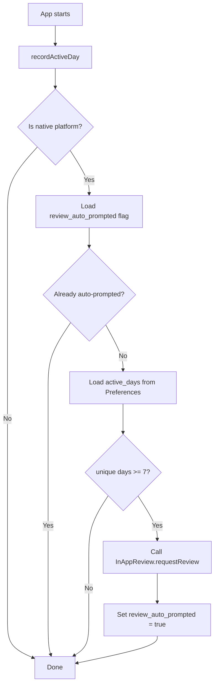

# In-App Review Feature Plan

## Overview

Add in-app review functionality to FireYak using [`@capacitor-community/in-app-review`](https://github.com/capacitor-community/in-app-review). Two trigger mechanisms:

1. **Manual** — A "Rate this app" button in the About page support card
2. **Automatic** — After a configurable number of active usage days, respecting iOS/Android platform guidelines

---

## Platform Guidelines

### iOS — StoreKit `SKStoreReviewController`
- Apple **controls** whether the dialog is actually displayed; calling `requestReview()` is only a *request*
- Maximum **3 prompts per 365-day period** per app
- Apple recommends waiting until the user has had a meaningful experience before prompting
- The dialog will not appear during development builds — only TestFlight/App Store builds

### Android — Google Play In-App Review API
- Google **controls** the display quota; the API may silently no-op if quota is exhausted
- Google recommends prompting after the user has experienced enough of the app's value
- The review flow is embedded — no redirect to the Play Store
- During development, use internal testing tracks to verify

### Key Takeaway
Both platforms throttle prompts automatically. Our job is to choose the right *moment* to request — the OS handles the rest. We should:
- Never prompt on first launch
- Track active usage days, not just calendar days
- **One-shot auto-prompt**: trigger automatically only once ever; after that, only the manual button on the About page can request a review

---

## Architecture

### New Files

| File | Purpose |
|---|---|
| [`src/composable/inAppReview.ts`](src/composable/inAppReview.ts) | Core composable: tracks active days, manages cooldown, triggers review |

### Modified Files

| File | Change |
|---|---|
| [`src/views/AboutView.vue`](src/views/AboutView.vue) | Add "Rate this App" button in the support card, only on native |
| [`src/locales/en.json`](src/locales/en.json) | Add `about.rateApp` and `about.rateAppDescription` keys |
| [`src/locales/de.json`](src/locales/de.json) | Add German translations for same keys |
| [`src/App.vue`](src/App.vue) | Call auto-prompt check on app mount |
| [`package.json`](package.json) | Add `@capacitor-community/in-app-review` dependency |

---

## Detailed Design

### 1. Composable: `src/composable/inAppReview.ts`

Uses Capacitor Preferences for persistence, matching the existing pattern in [`src/composable/settings.ts`](src/composable/settings.ts).

**Persisted keys:**
| Key | Type | Description |
|---|---|---|
| `review_active_days` | JSON string array | Array of ISO date strings recording unique days the app was used |
| `review_auto_prompted` | `"true"` or absent | Flag indicating the one-shot auto-prompt has already fired |

**Constants:**
| Name | Value | Description |
|---|---|---|
| `ACTIVE_DAYS_THRESHOLD` | `7` | Minimum unique active days before the one-shot auto-prompt fires |

**Exported functions:**

```typescript
function useInAppReview() {
  // Records today as an active usage day if not already recorded
  async function recordActiveDay(): Promise<void>

  // Checks if conditions are met and requests the review dialog (one-shot)
  // Conditions: native platform, threshold met, not already auto-prompted
  async function tryAutoPrompt(): Promise<void>

  // Directly requests the review dialog — for the manual button
  // On native: calls InAppReview.requestReview()
  // On web: no-op or could open store URL as fallback
  async function requestReview(): Promise<void>

  // Whether the current platform supports in-app review
  const isReviewAvailable: boolean
}
```

**Auto-prompt flow (one-shot):**



### 2. AboutView.vue — Manual Button

Add a "Rate this App" button inside the existing **Support the Project** card, right after the GitHub button. The button is only rendered on native platforms since `InAppReview` requires StoreKit/Play Store.

```
ion-button
  icon: starOutline
  text: about.rateApp
  @click: requestReview()
  v-if: isNative
```

The button placement within the support card makes contextual sense — the user is already looking at ways to support the project.

### 3. App.vue — Auto-Prompt Integration

In [`src/App.vue`](src/App.vue), after `loadSettings()`:

```typescript
const { recordActiveDay, tryAutoPrompt } = useInAppReview();

onMounted(async () => {
  await recordActiveDay();
  await tryAutoPrompt();
});
```

This runs once per app cold start. The composable internally ensures:
- Only one day is recorded per calendar day
- The auto-prompt fires only once ever (one-shot); subsequent launches skip it
- Non-native platforms are silently skipped
- The manual "Rate this App" button on the About page remains available for users who want to review later

### 4. i18n Keys

**English:**
```json
{
  "about": {
    "rateApp": "Rate this App",
    "rateAppDescription": "Enjoying FireYak? A quick rating helps others discover the app!"
  }
}
```

**German:**
```json
{
  "about": {
    "rateApp": "App bewerten",
    "rateAppDescription": "Gefällt dir FireYak? Eine kurze Bewertung hilft anderen, die App zu finden!"
  }
}
```

---

## Installation Steps

1. `npm install @capacitor-community/in-app-review`
2. `npx cap sync` — registers the native plugin on both iOS and Android
3. No additional native configuration needed — the plugin auto-registers

---

## Edge Cases & Considerations

| Scenario | Handling |
|---|---|
| Web/PWA platform | `isReviewAvailable` returns `false`; button hidden, auto-prompt skipped |
| OS rejects the prompt silently | Expected behavior per platform guidelines; no error handling needed |
| User clears app data | Active days reset; they get a fresh start before being prompted again |
| Manual button press fails | Wrap in try/catch; log error but don't show error to user — the OS may simply decline |
| App used offline | Preferences is local storage; works offline |

---

## Testing

- **Android**: Use internal testing track on Google Play to verify the review flow appears
- **iOS**: Use TestFlight builds; the dialog won't appear in Xcode debug builds
- **Web**: Verify the rate button is hidden and no errors occur
