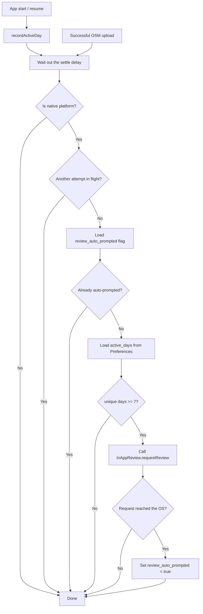

# In-App Review Feature Plan

## Overview

In-app review for FireYak using [`@capacitor-community/in-app-review`](https://github.com/capacitor-community/in-app-review), triggered **automatically** after a configurable number of active usage days, respecting iOS/Android platform guidelines.

A manual "Rate this app" button was considered and deliberately dropped — see below.

---

## Platform Guidelines

### iOS — StoreKit `SKStoreReviewController`
- Apple **controls** whether the dialog is actually displayed; calling `requestReview()` is only a *request*
- Maximum **3 prompts per 365-day period** per app
- Apple recommends waiting until the user has had a meaningful experience before prompting
- The dialog will not appear during development builds — only TestFlight/App Store builds

### Android — Google Play In-App Review API
- Google **controls** the display quota; the API may silently no-op if quota is exhausted
- Google recommends prompting after the user has experienced enough of the app's value
- The review flow is embedded — no redirect to the Play Store
- During development, use internal testing tracks to verify

### Key Takeaway
Both platforms throttle prompts automatically. Our job is to choose the right *moment* to request — the OS handles the rest. We should:
- Never prompt on first launch
- Track active usage days, not just calendar days
- **One-shot auto-prompt**: trigger automatically only once ever

### Why there is no manual "Rate this app" button
Both platforms explicitly discourage requesting the dialog in response to a
button tap, and once their quota is spent the request is a silent no-op — the
user taps "Rate this App" and nothing happens, which is worse than having no
button at all. The dialog is therefore only ever asked for on a time/usage
basis, and `requestReview()` is not exported from the composable so no caller
can bypass those rules.

---

## Architecture

### New Files

| File | Purpose |
|---|---|
| [`src/composable/inAppReview.ts`](src/composable/inAppReview.ts) | Core composable: tracks active days, manages cooldown, triggers review |

### Modified Files

| File | Change |
|---|---|
| [`src/App.vue`](src/App.vue) | Record the active day and schedule the auto-prompt, on cold start and on every resume |
| [`src/store/markerEditStore.ts`](src/store/markerEditStore.ts) | Attempt the auto-prompt after a successful OSM upload |
| [`package.json`](package.json) | Add `@capacitor-community/in-app-review` dependency |

---

## Detailed Design

### 1. Composable: `src/composable/inAppReview.ts`

Uses Capacitor Preferences for persistence, matching the existing pattern in [`src/composable/settings.ts`](src/composable/settings.ts).

**Persisted keys:**
| Key | Type | Description |
|---|---|---|
| `review_active_days` | JSON string array | Array of ISO date strings recording unique days the app was used |
| `review_auto_prompted` | `"true"` or absent | Flag indicating the one-shot auto-prompt has already fired |

**Constants:**
| Name | Value | Description |
|---|---|---|
| `ACTIVE_DAYS_THRESHOLD` | `7` | Minimum unique active days before the one-shot auto-prompt fires |

**Exported functions:**

```typescript
function useInAppReview() {
  // Records today as an active usage day if not already recorded.
  // Call on app start *and* on every resume — see below.
  async function recordActiveDay(): Promise<void>

  // Checks if conditions are met and requests the review dialog (one-shot)
  // Conditions: native platform, threshold met, not already auto-prompted.
  // The one-shot flag is only set once the request reached the OS, so a
  // failed call stays retryable.
  async function tryAutoPrompt(): Promise<void>

  // Whether the current platform supports in-app review
  const isReviewAvailable: boolean
}
```

`requestReview()` (the raw native call) is intentionally *not* exported, so no
caller can bypass the eligibility rules.

**Day keys use local time**, not `toISOString()` — the latter converts to UTC
first, which rolls the day over at the wrong local hour and files evening or
early-morning usage under the neighbouring day.

**Auto-prompt flow (one-shot):**


```mermaid
flowchart TD
    A[App start / resume] --> B[recordActiveDay]
    B --> B2[Wait out the settle delay]
    A2[Successful OSM upload] --> B2
    B2 --> C{Is native platform?}
    C -- No --> Z[Skip]
    C -- Yes --> C2{Another attempt in flight?}
    C2 -- Yes --> Z
    C2 -- No --> D[Load review_auto_prompted flag]
    D --> E{Already auto-prompted?}
    E -- Yes --> Z
    E -- No --> F[Load active_days from Preferences]
    F --> G{unique days >= 7?}
    G -- No --> Z
    G -- Yes --> H[Call InAppReview.requestReview]
    H --> H2{Request reached the OS?}
    H2 -- No --> Z
    H2 -- Yes --> I[Set review_auto_prompted = true]
    I --> Z[Done]
```

### 2. Trigger points

| Where | What runs | Why |
|---|---|---|
| [`src/App.vue`](src/App.vue) `onMounted` | `recordActiveDay()`, then the prompt after a settle delay | Cold start. The delay keeps the dialog off the still-loading map. Skipped when the What's New modal is showing. |
| [`src/App.vue`](src/App.vue) `appStateChange` | `recordActiveDay()`, then the prompt after a settle delay | **Essential.** A mobile app is resumed far more often than cold started, so counting only mounts undercounts active days badly — and a user who never swipes the app away would never be asked at all. |
| [`src/store/markerEditStore.ts`](src/store/markerEditStore.ts) after a successful upload | the prompt, once the success toast has gone | The best moment available: the user just contributed data to OSM. |

The composable internally ensures:
- Only one day is recorded per calendar day, keyed in local time
- The auto-prompt fires only once ever (one-shot); later attempts skip it
- Concurrent attempts from two trigger points cannot double-fire
- Non-native platforms are silently skipped
- Corrupt stored state degrades to "start over" rather than throwing into the startup path

---

## Installation Steps

1. `npm install @capacitor-community/in-app-review`
2. `npx cap sync` — registers the native plugin on both iOS and Android
3. No additional native configuration needed — the plugin auto-registers

---

## Edge Cases & Considerations

| Scenario | Handling |
|---|---|
| Web/PWA platform | `isReviewAvailable` returns `false`; auto-prompt skipped |
| OS rejects the prompt silently | Expected behavior per platform guidelines; no error handling needed |
| User clears app data | Active days reset; they get a fresh start before being prompted again |
| The plugin call throws | Logged, and the one-shot flag is **not** set — the single automatic prompt stays retryable instead of being lost |
| Corrupt `review_active_days` value | Treated as empty rather than thrown; must never break the startup path it runs in |
| App resumed rather than cold started | Handled by the `appStateChange` listener — without it the day counter barely moves |
| App used offline | Preferences is local storage; works offline |

---

## Testing

- **Android**: Use internal testing track on Google Play to verify the review flow appears
- **iOS**: Use TestFlight builds; the dialog won't appear in Xcode debug builds
- **Web**: Verify the rate button is hidden and no errors occur
