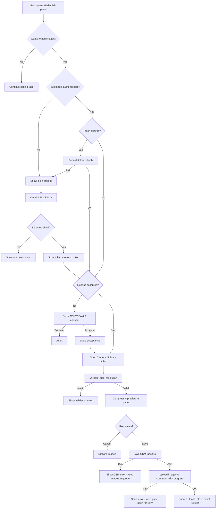

# Wikimedia Commons Image Upload — Plan Review & Analysis

## Summary

This document reviews the [wikimedia-commons-image-upload.md](wikimedia-commons-image-upload.md) plan, identifying pitfalls, suggesting improvements, and documenting Wikimedia API test environments for safe development.

---

## 1. Wikimedia API Test Environments

**Yes, Wikimedia provides dedicated test/beta environments.** This is critical for development and should be used before touching production Commons.

### 1.1 Beta Commons (Recommended for Development)

| Purpose | URL |
|---------|-----|
| **Beta Commons** | `https://commons.wikimedia.beta.wmflabs.org` |
| **Beta Meta Wiki** | `https://meta.wikimedia.beta.wmflabs.org` |
| **OAuth Consumer Registration** | `https://meta.wikimedia.beta.wmflabs.org/wiki/Special:OAuthConsumerRegistration/propose` |
| **OAuth Authorize** | `https://meta.wikimedia.beta.wmflabs.org/w/rest.php/oauth2/authorize` |
| **OAuth Token** | `https://meta.wikimedia.beta.wmflabs.org/w/rest.php/oauth2/access_token` |
| **API Base** | `https://commons.wikimedia.beta.wmflabs.org/w/api.php` |

**Key facts:**
- This is the official Wikimedia Beta Cluster — a full mirror of the production stack
- You can create a **separate test account** at `https://commons.wikimedia.beta.wmflabs.org`
- You must register a **separate OAuth2 consumer** on the beta meta wiki
- Uploads, edits, and deletions here are completely isolated from production
- The beta cluster resets periodically, so don't rely on it for persistent data
- Supports the same MediaWiki API endpoints as production

### 1.2 Test Wikipedia / Test Commons

| Purpose | URL |
|---------|-----|
| **Test Wikipedia** | `https://test.wikipedia.org` |
| **Test2 Wikipedia** | `https://test2.wikipedia.org` |

These are additional sandboxes but lack the full Commons file handling. Beta Commons above is the better choice.

### 1.3 Recommendation for the Plan

The plan's Risk table (Section 7) mentions *use Wikimedia test/beta wiki during development* but doesn't specify **how**. The implementation should:

1. **Add environment configuration** — make the Wikimedia OAuth endpoints and API base configurable via `.env` or a constants file, not hardcoded
2. **Register a beta OAuth consumer** alongside the production one
3. **Use beta Commons for all development and testing** (steps 17-18 in the todo list)
4. **Add a dev/staging toggle** to switch between beta and production endpoints

---

## 2. Critical Pitfalls

### 2.1 🔴 File Deletion Requires Admin Privileges

**The plan's own Risk table acknowledges this but the design ignores it.**

The [`deleteFile()`](wikimedia-commons-image-upload.md:199) function in [`wikimediaApi.ts`](wikimedia-commons-image-upload.md:84) proposes using `action=delete`, but this requires the `delete` right, which is only available to **administrators and file movers** on Commons. Regular users **cannot delete files**.

**Impact:** The entire existing-image-deletion UI (trash icons on existing images) will fail for all normal users.

**Mitigation options:**
- **Option A (Recommended):** Remove the delete functionality entirely. Instead, link users to the Commons file page where they can request deletion through the standard Commons process
- **Option B:** Use `action=edit` to add a speedy deletion template like `{{speedy|reason}}` to the file page — this requests deletion from admins but doesn't guarantee it
- **Option C:** Only allow deletion for images uploaded in the **current session** (before the upload is finalized), which is just removing from the local queue

### 2.2 🔴 Token Refresh / Expiry Not Addressed

The plan stores a single `access_token` but **Wikimedia OAuth2 tokens expire** (typically after 4 hours). The plan mentions no refresh token handling.

Looking at the existing [`osmAuthStore.ts`](src/store/osmAuthStore.ts:193), the OSM flow also only stores an access token — but `osm-api` may handle refresh internally. For Wikimedia's raw `fetch` approach, there's no such safety net.

**Impact:** Users will get silent 401 errors after the token expires, with no recovery path except logging in again.

**Mitigation:**
- Store the `refresh_token` alongside the `access_token` from the token response
- Implement a `refreshAccessToken()` function that uses the refresh token grant
- Add a fetch wrapper that detects 401 responses and automatically refreshes before retrying
- If refresh fails, prompt re-authentication

### 2.3 🔴 Service Worker Caching Interferes with API Write Operations

The existing [`vite.config.ts`](vite.config.ts:136) has a `StaleWhileRevalidate` cache for `commons.wikimedia.org/w/api.php`. This will cache **all** API responses including CSRF token requests and upload responses.

**Impact:** CSRF tokens will be stale from cache, causing upload failures. Upload success/error responses may be cached incorrectly.

**Mitigation:**
- The service worker caching rule should be scoped to **read-only** requests only (GET requests)
- Write operations (POST for upload, token fetch) should bypass the cache
- Alternatively, add a URL parameter like `_nocache` to write requests, or modify the cache pattern to only match specific read-only query patterns

### 2.4 🟡 Race Condition: OSM Save Succeeds but Image Upload Fails

The plan states (Section 4.8, step 7): *If image upload fails → show error toast but don't revert OSM changes*. This creates a partial-save state where:
- The OSM node exists with correct tags
- But no images are on Commons
- The user has lost their selected images (the panel closes or state resets)

**Mitigation:**
- Keep the edit panel open if image upload fails, allowing retry
- Store pending uploads in IndexedDB so they survive app restarts
- Add a `wikimedia:image` or `image` tag to OSM only after successful upload, not before

### 2.5 🟡 Filename Collision / Race with Other FireYak Users

The [`getNextFilename()`](wikimedia-commons-image-upload.md:209) function queries existing files then computes the next suffix. If two users upload images for the same node simultaneously, they could pick the same filename.

**Mitigation:**
- Include a timestamp or random suffix in the filename to avoid collisions, e.g. `Fire-fighting-facility node-12345 20260410-abc123.jpg`
- Or handle the `fileexists-no-change` / `duplicate` API error and retry with an incremented suffix

### 2.6 🟡 Missing Image Compression / Resizing

The plan mentions *compress images before upload* as a risk mitigation but doesn't include it in the component design or implementation steps. Modern phone cameras produce 10-30MB images.

**Mitigation:**
- Use `Camera.getPhoto()` with `quality: 80` and `width: 2048` to limit resolution
- Alternatively, use the `canvas` API to resize/compress before upload
- Add this as an explicit implementation step

### 2.7 🟡 EXIF Data / Privacy Concerns

Phone photos contain EXIF metadata including GPS coordinates, device model, and potentially user-identifiable information. Wikimedia Commons preserves EXIF data.

**Considerations:**
- GPS data is actually **useful** for geotagging fire hydrant images on Commons
- However, users should be informed that metadata is preserved
- Consider adding a note in the license consent dialog about metadata
- If privacy is a concern, strip all EXIF except GPS using a canvas-based re-encoding

### 2.8 🟡 InAppBrowser Redirect URI Matching Issue

In [`OAuthService.ts`](src/services/OAuthService.ts:42), the navigation listener uses `urlString.startsWith(redirectUri)` to detect the callback. The plan uses `https://app.fireyak.org/wikimedia-callback` as the redirect URI. However, when the OAuth provider redirects, the URL will be something like `https://app.fireyak.org/wikimedia-callback?code=xxx`.

On native, the InAppBrowser navigates to this URL. The Capacitor webview's server origin is `https://app.fireyak.org`, so the path `/wikimedia-callback` should resolve. But there's no actual page at this path in the native build (only `public/wikimedia-callback/index.html` exists for web). The InAppBrowser will likely see a 404 or blank page before the navigation listener fires.

**Impact:** May work fine since the listener fires on navigation completion regardless of HTTP status, but should be verified on both platforms.

**Mitigation:** Test the InAppBrowser flow thoroughly on both iOS and Android with the beta environment.

---

## 3. Suggested Improvements

### 3.1 Environment-Based Configuration

**Current plan:** Hardcodes production OAuth endpoints and client ID directly in [`wikimediaAuthStore.ts`](wikimedia-commons-image-upload.md:111).

**Improvement:** Use environment variables matching the existing pattern in [`.env`](.env):

```typescript
// wikimediaAuthStore.ts
const WIKIMEDIA_CLIENT_ID = import.meta.env.VITE_WIKIMEDIA_CLIENT_ID;
const WIKIMEDIA_BASE_URL = import.meta.env.VITE_WIKIMEDIA_BASE_URL 
    || 'https://meta.wikimedia.org';
const COMMONS_API_URL = import.meta.env.VITE_COMMONS_API_URL 
    || 'https://commons.wikimedia.org/w/api.php';
```

This enables switching to the beta cluster during development without code changes.

### 3.2 Extract a Generic OAuth2 PKCE Service

The plan mentions *extracting shared PKCE utilities* but the scope is limited to helper functions. A better abstraction:

```typescript
// src/services/OAuth2PKCEService.ts
interface OAuth2Config {
    clientId: string;
    authUrl: string;
    tokenUrl: string;
    redirectUri: string;
    scopes: string[];
    broadcastChannelName: string;
}

class OAuth2PKCEService {
    constructor(private config: OAuth2Config) {}
    async login(): Promise<TokenResponse> { /* ... */ }
    async refreshToken(refreshToken: string): Promise<TokenResponse> { /* ... */ }
}
```

Both [`osmAuthStore.ts`](src/store/osmAuthStore.ts) and `wikimediaAuthStore.ts` would use this. This avoids the code duplication that will inevitably grow as both stores evolve.

### 3.3 Add Workbox `navigateFallbackDenylist` Entry

The existing [`vite.config.ts`](vite.config.ts:88) already denylists [`land.html`](public/land.html) from the service worker's navigate fallback. The new `/wikimedia-callback` path needs the same treatment:

```typescript
navigateFallbackDenylist: [/^\/land\.html/, /^\/wikimedia-callback/]
```

And add to `globIgnores`:
```typescript
globIgnores: ['**/land.html', '**/wikimedia-callback/**']
```

**This is missing from the plan's Modified Files table.**

### 3.4 Category Improvements for Uploaded Images

The plan's wikitext template uses `[[Category:Fire hydrants]]` for all uploads. This should be dynamic based on the marker type:

| `emergency` tag value | Wikimedia Category |
|-----------------------|-------------------|
| `fire_hydrant` | `[[Category:Fire hydrants]]` |
| `suction_point` | `[[Category:Suction points]]` or `[[Category:Fire fighting water supply]]` |
| `water_tank` | `[[Category:Fire water tanks]]` or `[[Category:Water tanks]]` |
| `fire_water_pond` | `[[Category:Fire ponds]]` |

Also consider adding geographic categories based on reverse geocoding, e.g., `[[Category:Fire hydrants in Austria]]`.

### 3.5 Image Quality/Content Validation

Before uploading, consider basic validation:
- **File size check** — reject images over a sensible limit (e.g., 20MB after compression)
- **Minimum resolution** — reject tiny screenshots/thumbnails (e.g., below 640x480)
- **Duplicate detection** — use SHA1 hash to check if an identical file already exists on Commons via `action=query&prop=duplicatefiles`

### 3.6 Offline Queue for Failed Uploads

If the image upload fails (network issues, server errors), the user currently loses their work. An improvement:

- Store pending uploads in IndexedDB with the image blob, OSM node ID, and metadata
- Show a persistent notification/badge when uploads are pending
- Retry uploads automatically when connectivity returns
- Display pending uploads in a dedicated section or the settings page

### 3.7 Update `appUrlOpen` Handler in `main.ts`

The plan mentions updating [`main.ts`](src/main.ts:51) for Wikimedia callbacks but doesn't specify the exact change. The current [`appUrlOpen` handler](src/main.ts:64) checks `url.includes('?code=')` generically. With two OAuth providers, this needs to differentiate:

```typescript
if (url.includes('?code=')) {
    if (isNativeAuthInProgress()) {
        console.log('[OAuth/OSM] Ignoring — InAppBrowser flow active');
        return;
    }
    if (isNativeWikimediaAuthInProgress()) {
        console.log('[OAuth/Wikimedia] Ignoring — InAppBrowser flow active');
        return;
    }
    // Fallback handling...
}
```

### 3.8 Missing `vite.config.ts` in Modified Files

The plan's Modified Files table omits [`vite.config.ts`](vite.config.ts), but it needs changes for:
- Service worker denylist for `/wikimedia-callback`
- Glob ignore for the callback HTML file

---

## 4. Minor Issues & Observations

### 4.1 License Consent is One-Time Only

The plan stores license acceptance permanently in Preferences. Consider adding:
- A way to reset/revoke acceptance in Settings
- Showing a brief reminder per-upload session (not a full dialog, just a subtitle text)
- Version the acceptance so if terms change, users re-consent

### 4.2 Category `Uploaded with FireYak` May Need Creation

The `[[Category:Uploaded with FireYak]]` category likely doesn't exist on Commons yet. It should be created manually before the feature launches, with a proper category description page.

### 4.3 `XMLHttpRequest` vs `fetch` Inconsistency

The plan proposes using `fetch` for API calls but `XMLHttpRequest` for uploads (to get progress events). This creates two different HTTP patterns. Consider:
- Using `fetch` with `ReadableStream` for a more modern approach (though browser support for upload progress via fetch is still limited)
- Or consistently using `XMLHttpRequest` for all Wikimedia API calls
- Document this design decision clearly in the code

### 4.4 Wikitext Description Hardcodes English

The `{{Information}}` template description is in English only: *Fire-fighting facility documented by FireYak*. Consider making this bilingual using the `{{en|...}}{{de|...}}` template syntax based on the app's current locale.

### 4.5 Max 10 Images per Marker — Not Enforced in Design

The risk table mentions *max 10 images per marker* as a rate-limiting mitigation but neither the store state management nor the UI component design enforces this limit.

---

## 5. Updated Implementation Order Suggestion

Based on the pitfalls identified, I recommend reordering and adding steps:

1. **Set up beta environment** — Register test OAuth2 consumer on beta meta wiki, create beta test account
2. **Add environment configuration** — Make Wikimedia endpoints configurable via `.env` / `.env.development`
3. Install `@capacitor/camera` dependency and configure platform permissions
4. Extract shared OAuth2 PKCE service from [`osmAuthStore.ts`](src/store/osmAuthStore.ts) into a reusable class
5. Create `wikimediaAuthStore.ts` with login/logout/token management **including refresh token support**
6. Create `public/wikimedia-callback/index.html` for web OAuth callback
7. **Update [`vite.config.ts`](vite.config.ts) service worker config** — denylist callback path, scope API cache to GET-only
8. Update [`main.ts`](src/main.ts) to handle Wikimedia OAuth callbacks on native
9. Create `wikimediaApi.ts` — CSRF token, upload, query functions. **Remove delete function; replace with link to Commons page**
10. **Add image compression/resizing logic** before upload
11. Create `imageUploadStore.ts` for image selection and upload state
12. Create `MarkerImageUpload.vue` UI component **with file size/resolution validation**
13. Update [`settingsStore.ts`](src/store/settingsStore.ts) and [`settings.ts`](src/composable/settings.ts) with Wikimedia state
14. Integrate into [`MarkerEdit.vue`](src/components/MarkerEdit.vue) and [`markerEditStore.ts`](src/store/markerEditStore.ts) save flow
15. Add Wikimedia section to [`SettingsView.vue`](src/views/SettingsView.vue)
16. Add i18n translations with **dynamic categories based on marker type**
17. Update [`markerImageHandler.ts`](src/mapHandler/markerImageHandler.ts) for filename suffix resolution
18. **Test full OAuth flow on beta Commons** — web, Android, iOS
19. **Test upload/query cycle on beta Commons** — verify images appear, filenames are correct
20. Create `[[Category:Uploaded with FireYak]]` on production Commons
21. Switch to production endpoints and test end-to-end
22. Run `npm run buildAndSync`

---

## 6. Architecture Diagram — Improved Flow with Error Handling



---

## 7. Summary of Action Items

All items below have been incorporated into the [updated plan](wikimedia-commons-image-upload.md).

| Priority | Item | Section | Status |
|----------|------|---------|--------|
| 🔴 Critical | Remove/rethink file deletion — admin rights required | 2.1 | ✅ Incorporated — delete removed, replaced with Commons links |
| 🔴 Critical | Add refresh token handling for Wikimedia OAuth | 2.2 | ✅ Incorporated — Section 4.1 updated |
| 🔴 Critical | Fix service worker caching to exclude write operations | 2.3 | ✅ Incorporated — Section 4.11 added |
| 🟡 Important | Add `.env`-based endpoint configuration for beta/prod switching | 3.1 | ✅ Incorporated — Section 1 updated |
| 🟡 Important | Add image compression before upload | 2.6 | ✅ Incorporated — Section 4.5 added |
| 🟡 Important | Handle partial save state — keep panel open on upload failure | 2.4 | ✅ Incorporated — Section 4.9 updated |
| 🟡 Important | Add Workbox denylist for `/wikimedia-callback` | 3.3 | ✅ Incorporated — Section 4.11 added |
| 🟡 Important | Update `appUrlOpen` handler for dual OAuth providers | 3.7 | ✅ Incorporated — Section 4.10 updated |
| 🟢 Nice-to-have | Enforce max 10 images in UI | 4.5 | ✅ Incorporated — Sections 4.2, 4.3 updated |
