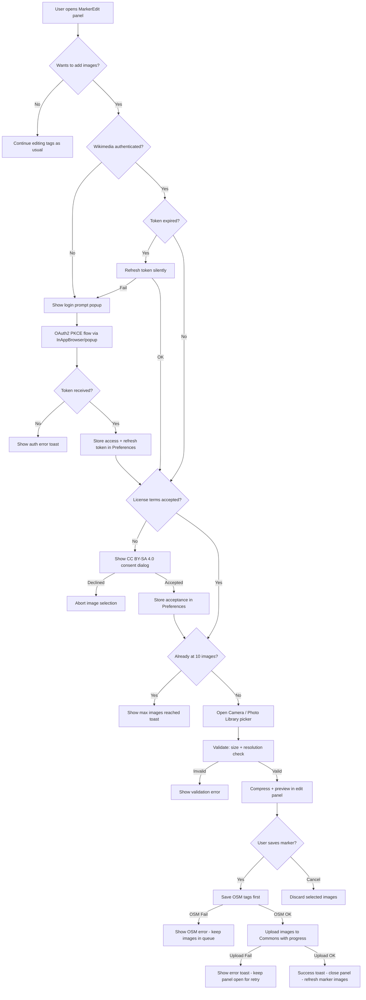

# Wikimedia Commons Image Upload — Architecture Plan

## Overview

Add the ability for users to upload images of fire-fighting facilities (hydrants, suction points, water tanks) to Wikimedia Commons during marker editing. This integrates a second OAuth2 provider (Wikimedia) alongside the existing OpenStreetMap OAuth2 flow, and uses Capacitor Camera for cross-platform image capture.

---

## Architecture Diagram



---

## 1. Prerequisites — Wikimedia OAuth2 Consumer Registration

Before development, register an OAuth2 consumer application:

1. Go to [Special:OAuthConsumerRegistration/propose](https://meta.wikimedia.org/wiki/Special:OAuthConsumerRegistration/propose)
2. Select **OAuth 2.0**
3. Set grant type: **Authorization code** with **PKCE**
4. Application name: `FireYak`
5. Callback URL: `https://app.fireyak.org/wikimedia-callback` (distinct from OSM's bare domain callback)
6. Required grants: **Edit existing pages**, **Create, edit, and move pages**, **Upload new files**, **Upload, replace, and move files**
7. ✅ **Client ID**: `c3f1191425e370137462408619af11c1` (registered and approved)

### OAuth2 Endpoints (Production)

| Purpose | URL |
|---------|-----|
| Authorize | `https://meta.wikimedia.org/w/rest.php/oauth2/authorize` |
| Token | `https://meta.wikimedia.org/w/rest.php/oauth2/access_token` |
| API Base | `https://commons.wikimedia.org/w/api.php` |

### Beta Cluster Endpoints (Development & Testing)

Wikimedia provides a full Beta Cluster that mirrors production. **All development and testing should use the beta environment** before switching to production.

| Purpose | URL |
|---------|-----|
| Beta Commons | `https://commons.wikimedia.beta.wmflabs.org` |
| Beta Meta Wiki | `https://meta.wikimedia.beta.wmflabs.org` |
| OAuth Consumer Registration | `https://meta.wikimedia.beta.wmflabs.org/wiki/Special:OAuthConsumerRegistration/propose` |
| OAuth Authorize | `https://meta.wikimedia.beta.wmflabs.org/w/rest.php/oauth2/authorize` |
| OAuth Token | `https://meta.wikimedia.beta.wmflabs.org/w/rest.php/oauth2/access_token` |
| API Base | `https://commons.wikimedia.beta.wmflabs.org/w/api.php` |

**Key facts about the Beta Cluster:**
- Create a **separate test account** at `https://commons.wikimedia.beta.wmflabs.org`
- Register a **separate OAuth2 consumer** on the beta meta wiki
- Uploads, edits, and all API operations are completely isolated from production
- Supports the same MediaWiki API endpoints and behavior as production
- The cluster resets periodically — don't rely on it for persistent data

### Environment Configuration

Wikimedia endpoints must be configurable via environment variables to switch between beta and production:

```env
# .env.development (Beta Cluster)
VITE_WIKIMEDIA_CLIENT_ID=<beta-client-id>
VITE_WIKIMEDIA_BASE_URL=https://meta.wikimedia.beta.wmflabs.org
VITE_COMMONS_API_URL=https://commons.wikimedia.beta.wmflabs.org/w/api.php

# .env.production (Production)
VITE_WIKIMEDIA_CLIENT_ID=c3f1191425e370137462408619af11c1
VITE_WIKIMEDIA_BASE_URL=https://meta.wikimedia.org
VITE_COMMONS_API_URL=https://commons.wikimedia.org/w/api.php
```

---

## 2. New Dependencies

| Package | Purpose |
|---------|---------|
| `@capacitor/camera` | Cross-platform camera/photo library access (iOS, Android, Web) |

> **Note on m3api**: After evaluation, using the MediaWiki API directly via `fetch` is simpler for our use case (upload + CSRF token). The `m3api` library adds complexity with its session management and Node.js-focused design. We will use direct `fetch` calls with the OAuth2 bearer token, which aligns with the existing OSM API pattern. If preferred, m3api can be added later.

### Capacitor Camera Setup

- Install: `npm install @capacitor/camera`
- iOS: add `NSCameraUsageDescription` and `NSPhotoLibraryUsageDescription` to `Info.plist`
- Android: permissions are handled automatically by Capacitor
- Web: uses browser `<input type="file">` fallback automatically

---

## 3. New & Modified Files

### New Files

| File | Purpose |
|------|---------|
| [`src/store/wikimediaAuthStore.ts`](src/store/wikimediaAuthStore.ts) | Pinia store for Wikimedia Commons OAuth2 authentication (login, logout, token + refresh token management) |
| [`src/store/imageUploadStore.ts`](src/store/imageUploadStore.ts) | Pinia store managing image selection queue, upload progress, compression, and Commons API interactions |
| [`src/components/MarkerImageUpload.vue`](src/components/MarkerImageUpload.vue) | UI component for image capture/selection, preview thumbnails, upload progress, and view-on-Commons links |
| [`src/helper/wikimediaApi.ts`](src/helper/wikimediaApi.ts) | Pure helper functions for Wikimedia Commons API calls (CSRF token, upload, query existing) |
| [`public/wikimedia-callback/index.html`](public/wikimedia-callback/index.html) | OAuth2 callback landing page for web popup flow (served at `/wikimedia-callback`) |
| `.env.development` | Beta Cluster Wikimedia endpoints for development |
| `.env.production` | Production Wikimedia endpoints |

### Modified Files

| File | Change |
|------|--------|
| [`src/components/MarkerEdit.vue`](src/components/MarkerEdit.vue) | Add `MarkerImageUpload` component section before action buttons |
| [`src/store/markerEditStore.ts`](src/store/markerEditStore.ts) | Integrate image upload into `saveMarker` flow; trigger uploads after OSM save succeeds; keep panel open on upload failure |
| [`src/views/SettingsView.vue`](src/views/SettingsView.vue) | Add Wikimedia Commons account section (login/logout) below OSM account section |
| [`src/composable/settings.ts`](src/composable/settings.ts) | Add `saveWikimediaTokens`, `removeWikimediaTokens`, `getWikimediaTokens`, `saveWikimediaLicenseAccepted`, `getWikimediaLicenseAccepted` |
| [`src/store/settingsStore.ts`](src/store/settingsStore.ts) | Add `wikimediaAccessToken`, `wikimediaRefreshToken`, and `wikimediaLicenseAccepted` state fields + setters |
| [`src/locales/en.json`](src/locales/en.json) | Add all English translations for Wikimedia auth, image upload, license consent |
| [`src/locales/de.json`](src/locales/de.json) | Add all German translations |
| [`src/mapHandler/markerImageHandler.ts`](src/mapHandler/markerImageHandler.ts) | Add helper to determine next available image filename suffix |
| [`src/main.ts`](src/main.ts) | Update `appUrlOpen` handler to check both OSM and Wikimedia auth-in-progress flags |
| [`vite.config.ts`](vite.config.ts) | Add `/wikimedia-callback` to Workbox `navigateFallbackDenylist` and `globIgnores`; scope Commons API cache to GET-only |
| [`capacitor.config.ts`](capacitor.config.ts) | Add Camera plugin permissions config if needed |
| [`package.json`](package.json) | Add `@capacitor/camera` dependency |

---

## 4. Detailed Component Design

### 4.1 `wikimediaAuthStore.ts` — Wikimedia OAuth2 Store

Mirrors the pattern of [`osmAuthStore.ts`](src/store/osmAuthStore.ts) with these specifics:

```typescript
// Endpoints from environment variables (defaults to production)
const WIKIMEDIA_CLIENT_ID = import.meta.env.VITE_WIKIMEDIA_CLIENT_ID || 'c3f1191425e370137462408619af11c1';
const WIKIMEDIA_BASE_URL = import.meta.env.VITE_WIKIMEDIA_BASE_URL || 'https://meta.wikimedia.org';
const COMMONS_API_URL = import.meta.env.VITE_COMMONS_API_URL || 'https://commons.wikimedia.org/w/api.php';
const WIKIMEDIA_AUTH_URL = `${WIKIMEDIA_BASE_URL}/w/rest.php/oauth2/authorize`;
const WIKIMEDIA_TOKEN_URL = `${WIKIMEDIA_BASE_URL}/w/rest.php/oauth2/access_token`;
const REDIRECT_URI = 'https://app.fireyak.org/wikimedia-callback';
// Same URI for both native and web — on native the InAppBrowser intercepts
// the navigation before the page loads; on web it resolves to
// public/wikimedia-callback/index.html which relays the code via BroadcastChannel

// Store state
- isAuthenticated: ref<boolean>
- user: ref<WikimediaUser | null>  // { name, id }

// Actions
- login()              // Handles native InAppBrowser + web popup flows
- logout()             // Clears tokens from Preferences
- loadToken()          // Restores session from stored token on app start
- refreshAccessToken() // Uses refresh token to get a new access token
- fetchUser()          // GET COMMONS_API_URL?action=query&meta=userinfo
```

**PKCE flow** reuses the same [`OAuthService`](src/services/OAuthService.ts) class and `generateCodeVerifier`/`generateCodeChallenge` helpers (extracted to a shared utility).

**Token refresh**: Wikimedia OAuth2 access tokens expire after ~4 hours. The store must:
1. Store both `access_token` and `refresh_token` from the token response
2. Implement `refreshAccessToken()` using the `grant_type=refresh_token` flow
3. All API-calling functions in `wikimediaApi.ts` should use a fetch wrapper that:
   - Detects 401 responses
   - Automatically calls `refreshAccessToken()`
   - Retries the failed request once with the new token
   - If refresh fails, sets `isAuthenticated = false` and prompts re-login

```typescript
// Token refresh implementation
async function refreshAccessToken(): Promise<void> {
    const refreshToken = await getWikimediaRefreshToken();
    if (!refreshToken) throw new Error('No refresh token available');

    const response = await fetch(WIKIMEDIA_TOKEN_URL, {
        method: 'POST',
        headers: { 'Content-Type': 'application/x-www-form-urlencoded' },
        body: new URLSearchParams({
            grant_type: 'refresh_token',
            refresh_token: refreshToken,
            client_id: WIKIMEDIA_CLIENT_ID,
        }).toString()
    });

    if (!response.ok) throw new Error('Token refresh failed');
    const data = await response.json();
    await saveWikimediaTokens(data.access_token, data.refresh_token);
}
```

**Web popup flow**: A new [`public/wikimedia-callback/index.html`](public/wikimedia-callback/index.html) listens for the `?code=` param and uses a `BroadcastChannel('wikimedia-auth-complete')` to relay the code back to the opener window. This file is served at `https://app.fireyak.org/wikimedia-callback` (the directory index).

### 4.2 `imageUploadStore.ts` — Image Upload State

```typescript
// Constants
const MAX_IMAGES_PER_MARKER = 10;

// State
- selectedImages: ref<SelectedImage[]>    // { uri, webPath, blob?, name }
- uploadProgress: ref<number>             // 0-100 percentage
- isUploading: ref<boolean>
- existingImages: ref<WikiPage[]>         // from markerImageHandler

// Computed
- canAddMore: computed                    // existingImages.length + selectedImages.length < MAX_IMAGES_PER_MARKER
- remainingSlots: computed                // MAX_IMAGES_PER_MARKER - existingImages.length - selectedImages.length

// Actions
- selectImage()                // Opens Capacitor Camera picker (checks max limit first)
- removeSelectedImage(index)
- uploadAll(osmId)             // Compresses then uploads all selected images to Commons
- loadExistingImages(osmId)    // Fetches current images for this marker
- reset()                      // Clears selection state
```

### 4.3 `MarkerImageUpload.vue` — Image Upload UI Component

Placed inside [`MarkerEdit.vue`](src/components/MarkerEdit.vue:620) as a new `ion-item-group` between the survey date section and the action buttons.

**Layout:**

```
┌──────────────────────────────────┐
│  📷 Images (3/10)                 │  ← ion-item-divider with count
├──────────────────────────────────┤
│  [thumb1] [thumb2] [thumb3] [+]  │  ← horizontal scroll of thumbnails
│                                  │     + button disabled at max 10
├──────────────────────────────────┤
│  Existing images on Commons:     │  ← if editing an existing marker
│  [img1 🔗] [img2 🔗]             │     with link-to-Commons buttons
├──────────────────────────────────┤
│  ████████████░░░░░ 65%           │  ← upload progress bar (during upload)
│  Uploading image 2 of 3...      │
└──────────────────────────────────┘
```

**Key behaviors:**
- Tapping [+] or the camera button triggers `Camera.getPhoto()` with `source: CameraSource.Prompt` (lets user choose camera vs library) and `quality: 80`, `width: 2048` to limit resolution and file size
- The [+] button is disabled when the combined count of existing + selected images reaches 10, with a toast explaining the limit
- If Wikimedia is not authenticated → show login prompt alert (same pattern as OSM auth dialog in [`markerEditStore.ts:61-79`](src/store/markerEditStore.ts:61))
- If license not yet accepted → show CC BY-SA 4.0 consent alert before first image selection
- Thumbnails show a preview with an X button to remove before upload
- Existing Commons images show with a 🔗 link icon that opens the Commons file page in the browser (no client-side deletion — see Section 4.4)
- Progress bar uses `ion-progress-bar` during upload
- Basic validation before adding to queue: reject files over 20MB (after compression), reject images below 640×480

**Why no delete functionality:** Deleting files on Wikimedia Commons requires administrator privileges (`delete` right). Regular users cannot delete files via the API. Instead, existing images link to their Commons page where users can follow the standard Commons process (e.g. nominate for deletion) if needed.

### 4.4 `wikimediaApi.ts` — API Helper Functions

```typescript
// Authenticated fetch wrapper with automatic token refresh
async function wikimediaFetch(url: string, options: RequestInit, accessToken: string): Promise<Response>
// - Adds Bearer token header
// - Detects 401 responses and triggers token refresh
// - Retries the request once with the new token
// - Throws if refresh also fails

// Get a CSRF token (required for write operations)
async function getCsrfToken(accessToken: string): Promise<string>

// Compress an image blob to JPEG with max dimensions and quality
async function compressImage(blob: Blob, maxWidth: number = 2048, quality: number = 0.8): Promise<Blob>

// Upload a single file to Wikimedia Commons
async function uploadFile(params: {
    accessToken: string,
    filename: string,       // e.g. "Fire-fighting-facility node-12345 2.jpg"
    file: Blob,
    description: string,    // Wikitext with {{Information}} template
    comment: string,        // Edit summary
    onProgress?: (percent: number) => void
}): Promise<UploadResult>

// Query existing files for a marker to determine next suffix
async function queryExistingFiles(osmId: number): Promise<string[]>

// Get the next available filename
function getNextFilename(osmId: number, existingFiles: string[]): string
```

**Image description template** (wikitext):
```
=={{int:filedesc}}==
{{Information
|description={{en|1=Fire-fighting facility documented by FireYak <VERSION>. OSM Node ID: <OSM_ID>}}
|date=<UPLOAD_DATE>
|source={{own}} — uploaded with [https://app.fireyak.org FireYak] <VERSION>
|author=[[User:<USERNAME>|<USERNAME>]]
}}

=={{int:license-header}}==
{{cc-by-sa-4.0|<USERNAME>}}

[[Category:Fire hydrants]]
[[Category:Uploaded with FireYak]]
```

The `<VERSION>` placeholder is replaced at runtime with the app version from `package.json` (e.g. `2.11.1`), imported the same way as in [`markerEditStore.ts:12`](src/store/markerEditStore.ts:12): `import { version } from '@/../package.json'`.

The edit comment will include: `Uploaded via FireYak <VERSION>`

### 4.5 Image Compression & Validation

Before upload, all images are validated and compressed:

**Validation rules:**
- Maximum file size after compression: 20MB (reject with error toast)
- Minimum resolution: 640×480 (reject tiny screenshots/thumbnails)
- Maximum images per marker: 10 (including existing Commons images)

**Compression pipeline:**
1. `Camera.getPhoto()` is called with `quality: 80` and `width: 2048` for initial capture-time compression
2. Before upload, `compressImage()` uses a `<canvas>` element to:
   - Resize to max 2048px on the longest edge (preserving aspect ratio)
   - Re-encode as JPEG at 80% quality
   - This typically reduces a 10-30MB phone photo to 500KB-2MB

### 4.6 Upload Progress

The MediaWiki API upload endpoint does not support streaming progress natively via `fetch`. To show upload progress:

- Use `XMLHttpRequest` with `upload.onprogress` event for actual byte-level progress tracking
- Track per-file progress (e.g., "Uploading image 2 of 3...")
- Overall progress = (completed files + current file progress) / total files

### 4.7 License Consent Flow

**First-time consent dialog** (shown before the first image selection, stored permanently):

```
┌─────────────────────────────────────┐
│  Image Upload Terms                  │
│                                      │
│  By uploading images to Wikimedia    │
│  Commons, you confirm that:          │
│                                      │
│  • The images are your own work      │
│  • They provide useful information   │
│    about fire-fighting facilities    │
│  • They comply with Wikimedia        │
│    Commons policies                  │
│  • You license them under            │
│    CC BY-SA 4.0                      │
│                                      │
│  [Cancel]              [I Agree]     │
└─────────────────────────────────────┘
```

- Acceptance is stored via `Preferences` as `wikimedia_license_accepted: 'true'`
- Once accepted, the dialog is not shown again
- Uses `alertController.create()` matching the existing OSM auth dialog pattern

### 4.8 Settings Page Changes

Add a new section to [`SettingsView.vue`](src/views/SettingsView.vue) after the OSM account section:

```
┌─────────────────────────────────────┐
│  Wikimedia Commons                   │  ← ion-list-header
│                                      │
│  (if authenticated)                  │
│  Wikimedia Commons Account           │
│  Logged in as <username>             │
│  [Manage Account]    [Logout]        │
│                                      │
│  (if not authenticated)              │
│  Log in to upload images of          │
│  fire-fighting facilities to         │
│  Wikimedia Commons.                  │
│  [Login to Wikimedia]                │
└─────────────────────────────────────┘
```

### 4.9 Integration with Marker Edit Save Flow

The image upload happens **after** the OSM save completes successfully:

1. User fills in tag edits + selects images
2. User taps "Save to OSM"
3. [`markerEditStore.saveMarker()`](src/store/markerEditStore.ts:105) uploads tag changes to OSM
4. If OSM save succeeds AND images are selected → trigger `imageUploadStore.uploadAll(osmId)`
5. Show upload progress inline in the MarkerEdit panel (panel stays open during upload)
6. Once all uploads complete → show success toast → close panel
7. **If image upload fails → show error toast, keep the edit panel open with a "Retry Upload" button.** The OSM changes are not reverted (they're independent). The selected images remain in the queue so the user can retry without re-selecting them.

For **new markers** (adding mode): The OSM ID is only known after the OSM save returns the `diffResult`. The upload uses this new ID for the filename.

### 4.10 Handling OAuth Callback Conflicts

OSM and Wikimedia use **different** redirect URIs, which avoids collision:
- **OSM**: `https://app.fireyak.org` (existing, bare domain)
- **Wikimedia**: `https://app.fireyak.org/wikimedia-callback` (new, distinct path)

On **native**, the `appUrlOpen` handler in [`main.ts`](src/main.ts:51) must check **both** OAuth in-progress flags:

```typescript
// Updated appUrlOpen handler in main.ts
if (url.includes('?code=')) {
    if (isNativeAuthInProgress()) {
        console.log('[OAuth/OSM] Ignoring appUrlOpen — InAppBrowser flow is active');
        return;
    }
    if (isNativeWikimediaAuthInProgress()) {
        console.log('[OAuth/Wikimedia] Ignoring appUrlOpen — InAppBrowser flow is active');
        return;
    }
    // Fallback: handle as before
    window.location.replace('/?' + url.split('?')[1]);
    const osmAuthStore = useOsmAuthStore();
    await osmAuthStore.loadToken();
    return router.push('/');
}
```

The `wikimediaAuthStore` exports its own `isNativeWikimediaAuthInProgress()` function (same pattern as [`osmAuthStore.ts:32-37`](src/store/osmAuthStore.ts:32)).

On **web**, each provider has its own callback page:
- OSM: `public/land.html` → BroadcastChannel `osm-api-auth-complete`
- Wikimedia: `public/wikimedia-callback/index.html` → BroadcastChannel `wikimedia-auth-complete`

For Android App Links to work with the new `/wikimedia-callback` path, the existing `assetlinks.json` should already cover it since it validates the entire domain. For iOS Universal Links, the `apple-app-site-association` file already uses `"paths": ["*"]` which covers all paths.

### 4.11 Service Worker / Workbox Configuration Changes

The existing [`vite.config.ts`](vite.config.ts) needs three changes:

**1. Add `/wikimedia-callback` to the navigate fallback denylist** to prevent the service worker from intercepting the OAuth callback:

```typescript
navigateFallbackDenylist: [/^\/land\.html/, /^\/wikimedia-callback/]
```

**2. Add the callback HTML to glob ignores** so it's not precached:

```typescript
globIgnores: ['**/land.html', '**/wikimedia-callback/**']
```

**3. Scope the Commons API cache to read-only requests.** The existing `StaleWhileRevalidate` rule for `commons.wikimedia.org/w/api.php` will cache **all** API responses, including CSRF token requests and upload responses. CSRF tokens become stale from cache, causing upload failures. Fix by restricting the pattern to only match read-only GET query patterns:

```typescript
{
    // Only cache read-only API requests (GET with action=query)
    urlPattern: /^https?:\/\/commons\.wikimedia\.org\/w\/api\.php\?action=query.*/,
    handler: 'StaleWhileRevalidate',
    options: {
        cacheName: 'wikimedia-api-cache',
        expiration: {
            maxEntries: 100,
            maxAgeSeconds: 7 * 24 * 60 * 60 // 7 days
        },
        cacheableResponse: { statuses: [0, 200] }
    }
}
```

---

## 5. i18n Translation Keys

### New keys to add:

**`wikimediaAuth.*`** — Authentication strings
- `wikimediaAuth.authDialog.title` — "Wikimedia Commons Account Required"
- `wikimediaAuth.authDialog.message` — "You need a Wikimedia Commons account to upload images."
- `wikimediaAuth.buttons.login` — "Login to Wikimedia"
- `wikimediaAuth.buttons.logout` — "Logout"
- `wikimediaAuth.sessionExpired` — "Your Wikimedia session has expired. Please log in again."

**`imageUpload.*`** — Image upload strings
- `imageUpload.title` — "Images"
- `imageUpload.count` — "{count} of {max}"
- `imageUpload.addImage` — "Add Image"
- `imageUpload.takePhoto` — "Take Photo"
- `imageUpload.chooseFromLibrary` — "Choose from Library"
- `imageUpload.uploading` — "Uploading image {current} of {total}..."
- `imageUpload.uploadSuccess` — "Images uploaded to Wikimedia Commons!"
- `imageUpload.uploadError` — "Image upload failed. The marker was saved successfully."
- `imageUpload.retryUpload` — "Retry Upload"
- `imageUpload.existingImages` — "Existing images"
- `imageUpload.newImages` — "New images to upload"
- `imageUpload.viewOnCommons` — "View on Wikimedia Commons"
- `imageUpload.maxReached` — "Maximum of {max} images per marker reached."
- `imageUpload.tooSmall` — "Image is too small. Minimum resolution is 640×480."
- `imageUpload.tooLarge` — "Image file is too large (max {max}MB)."

**`imageUpload.license.*`** — License consent strings
- `imageUpload.license.title` — "Image Upload Terms"
- `imageUpload.license.message` — "By uploading images to Wikimedia Commons, you confirm that:\n\n• The images are your own work\n• They provide useful information about fire-fighting facilities\n• They comply with Wikimedia Commons policies\n• You license them under CC BY-SA 4.0"
- `imageUpload.license.agree` — "I Agree"
- `imageUpload.license.decline` — "Cancel"

**`settings.account.wikimedia*`** — Settings page
- `settings.account.wikimediaTitle` — "Wikimedia Commons"
- `settings.account.wikimediaAccount` — "Wikimedia Commons Account"
- `settings.account.wikimediaLoginDescription` — "Log in to upload images of fire-fighting facilities to Wikimedia Commons."

---

## 6. Implementation Order (Todo List)

1. Register Wikimedia OAuth2 consumer application on **beta cluster** (manual step)
2. Add `.env.development` and `.env.production` with Wikimedia endpoint configuration
3. Install `@capacitor/camera` dependency and configure platform permissions
4. Extract shared PKCE utilities from `osmAuthStore.ts` into a reusable helper
5. Create `wikimediaAuthStore.ts` with OAuth2 PKCE login/logout/token management **including refresh token support**
6. Create `public/wikimedia-callback/index.html` for web OAuth callback
7. Update [`vite.config.ts`](vite.config.ts) — add Workbox denylist for `/wikimedia-callback`, glob ignores, and scope Commons API cache to GET-only
8. Update [`main.ts`](src/main.ts) `appUrlOpen` handler to check both OSM and Wikimedia auth-in-progress flags
9. Create `src/helper/wikimediaApi.ts` with authenticated fetch wrapper, CSRF token, image compression, upload, and query functions
10. Create `src/store/imageUploadStore.ts` for image selection, validation, compression, and upload state management (with max 10 limit)
11. Create `src/components/MarkerImageUpload.vue` UI component with validation, compression, progress, and Commons links for existing images
12. Update `src/store/settingsStore.ts` with Wikimedia access token, refresh token, and license acceptance state
13. Update `src/composable/settings.ts` with Wikimedia token persistence functions
14. Integrate `MarkerImageUpload` into `MarkerEdit.vue`
15. Update `markerEditStore.ts` save flow to trigger image uploads after OSM save; **keep panel open with retry on upload failure**
16. Add Wikimedia Commons login/logout section to `SettingsView.vue`
17. Add all i18n translations to `en.json` and `de.json`
18. Update `markerImageHandler.ts` to support filename suffix resolution
19. **Test full OAuth flow on beta Commons** — web, Android, and iOS
20. **Test image capture, compression, validation, and upload on beta Commons**
21. Register production OAuth2 consumer (if not already done)
22. Switch to production endpoints and test end-to-end
23. Update `capacitor.config.ts` if Camera plugin config is needed
24. Run `npm run buildAndSync` to sync native platforms

---

## 7. Risk Considerations

| Risk | Mitigation |
|------|------------|
| Wikimedia OAuth2 consumer registration may take time for approval | Start registration early; **use beta cluster during development** with separate beta consumer |
| **OAuth2 access tokens expire after ~4 hours** | **Store refresh token alongside access token; implement automatic token refresh with retry logic on 401 responses** |
| **Service worker caches CSRF tokens and write API responses** | **Scope the Workbox `commons.wikimedia.org` cache rule to only match `action=query` GET requests; write operations bypass cache** |
| Image upload may fail on large files or poor network | **Compress images before upload (2048px max, 80% JPEG quality); validate file size < 20MB and resolution ≥ 640×480;** keep panel open with retry button on failure |
| OAuth callback collision between OSM and Wikimedia on native | Different redirect URIs: OSM uses bare domain, Wikimedia uses `/wikimedia-callback` path; **both auth-in-progress flags checked in `appUrlOpen`** |
| CORS issues with Wikimedia API from web | Wikimedia API supports `origin=*` parameter for CORS; add it to all requests |
| Camera permissions denied by user | Handle gracefully with permission-denied error messages |
| Wikimedia rate limiting on uploads | Add small delay between multiple file uploads; **enforce max 10 images per marker in UI** |
| ~~File deletion requires admin rights on Commons~~ | **Removed: No client-side delete functionality.** Existing images link to their Commons page where users can follow the standard Commons deletion process if needed |
| **Service worker intercepts `/wikimedia-callback` path** | **Add `/wikimedia-callback` to Workbox `navigateFallbackDenylist` and `globIgnores`** |
